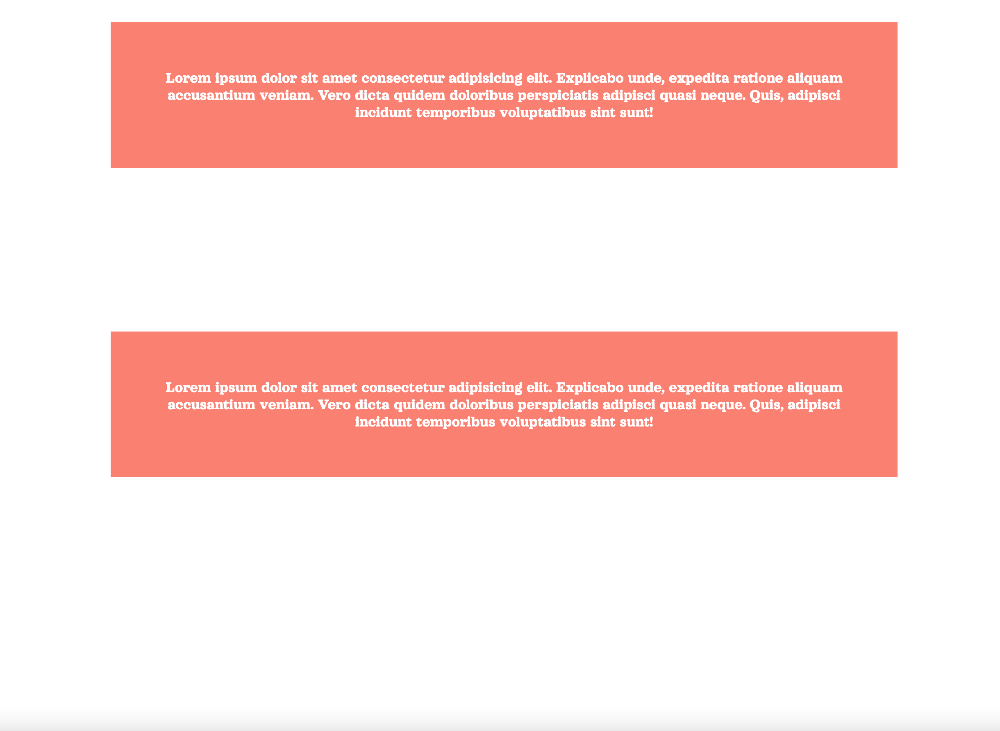
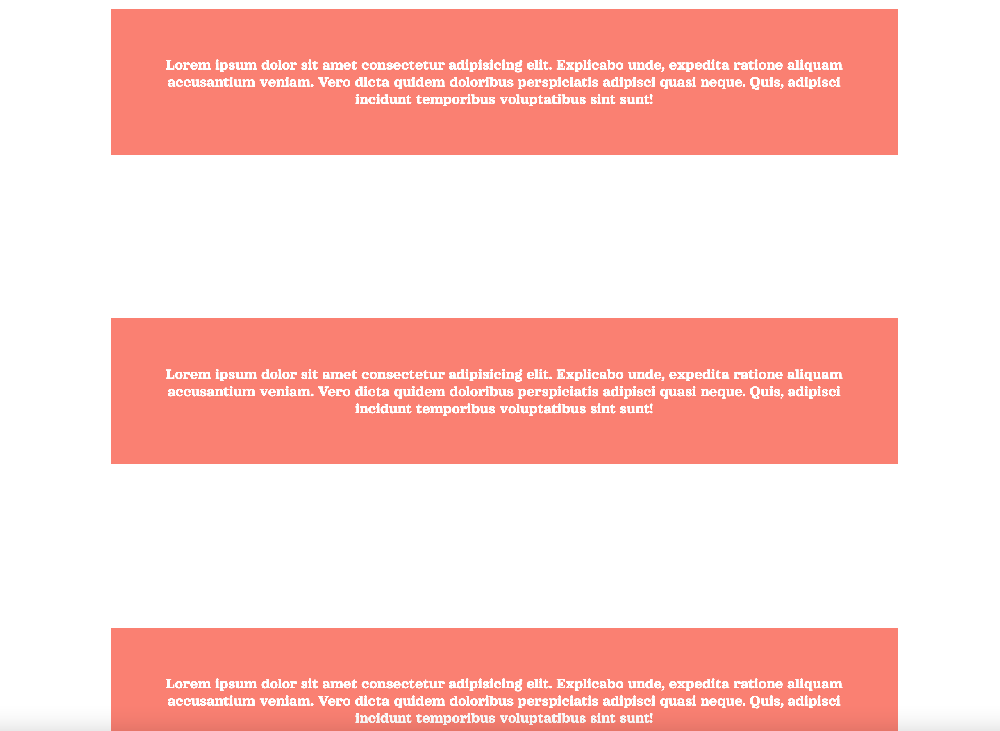

# Intersection-observer-practice

Intersection Observer practice using a fade in and fade out effect.

The div does not visible when it is not within the screen.

As the user scrolls down, the div becomes visible because of the intersection observer.
